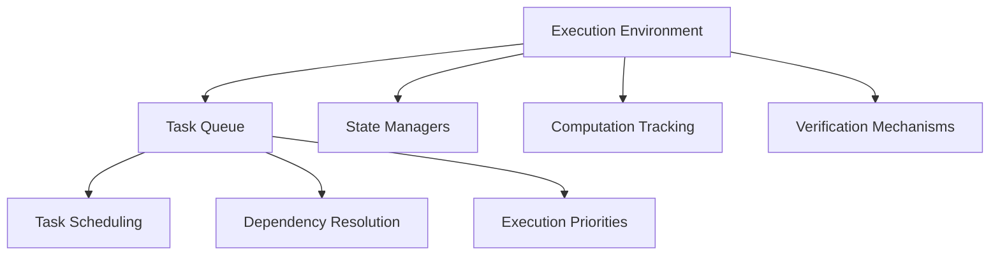

# L2 Machine: Decentralized Layer 2 Execution Environment

A cutting-edge Layer 2 state management and computation orchestration smart contract built on the Stacks blockchain.

## Overview

L2 Machine provides a robust, decentralized infrastructure for executing complex computational tasks across distributed networks. By leveraging blockchain technology, it ensures:

- Deterministic task execution
- State synchronization
- Transparent computational tracking
- Secure task scheduling
- Verifiable computation logs
- Modular task management

## Architecture

The system is built around a core smart contract that manages computational tasks, state transitions, and execution tracking. Key components include:



## Contract Documentation

### Core Contract (layer-two-machine.clar)

The main contract that handles Layer 2 computational orchestration and state management.

#### Key Features:
- Distributed task scheduling
- Computational state tracking
- Execution priority management
- Deterministic computation logs
- Cross-network synchronization
- Secure task verification

#### Execution Hierarchy:
1. System Coordinator (highest permissions)
2. Task Scheduler
3. Computation Validator
4. Observer (lowest permissions)

## Getting Started

### Prerequisites
- Clarinet
- Stacks wallet
- Node.js environment

### Installation

1. Clone the repository
2. Install dependencies
```bash
clarinet install
```
3. Run tests
```bash
clarinet test
```

## Function Reference

### Project Management

```clarity
(create-project (title (string-utf8 100)) 
                (description (string-utf8 500))
                (start-date uint)
                (end-date uint)
                (budget uint))
```

```clarity
(update-project (project-id uint)
                (title (string-utf8 100))
                (description (string-utf8 500))
                (status uint)
                (start-date uint)
                (end-date uint)
                (budget uint))
```

### Task Management

```clarity
(create-task (project-id uint)
             (title (string-utf8 100))
             (description (string-utf8 500))
             (assignee (optional principal))
             (priority uint)
             (estimated-hours uint)
             (start-date uint)
             (due-date uint)
             (milestone-id (optional uint)))
```

```clarity
(update-task-status (project-id uint)
                    (task-id uint)
                    (new-status uint))
```

### Team Management

```clarity
(add-team-member (project-id uint)
                 (member principal)
                 (role uint))
```

```clarity
(update-team-member-role (project-id uint)
                        (member principal)
                        (new-role uint))
```

## Development

### Testing

Run the test suite:
```bash
clarinet test
```

### Local Development

1. Start local chain:
```bash
clarinet integrate
```

2. Deploy contracts:
```bash
clarinet deploy
```

## Security Considerations

1. Role-based access control
   - All sensitive operations require appropriate permissions
   - Owner role cannot be transferred or removed

2. Data Validation
   - All inputs are validated before processing
   - Status transitions are properly controlled

3. Dependency Management
   - Circular dependencies are prevented
   - Task dependencies must be completed before dependent tasks can start

4. State Management
   - Critical state changes are atomic
   - Activity logging provides audit trail

5. Known Limitations
   - No bulk operations supported
   - Cannot delete projects or tasks (only cancel)
   - File storage must be handled off-chain